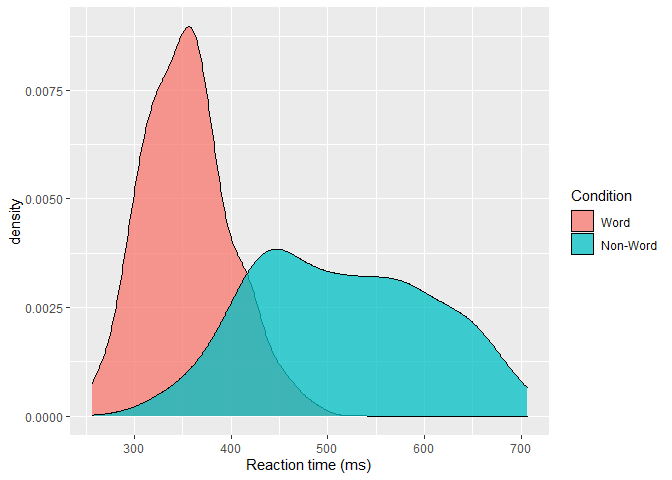

<!-- README.md is generated from README.Rmd. Please edit that file -->

# beginr

<!-- badges: start -->
<!-- badges: end -->

The goal of `beginr` is to make it a bit easier to learn R. It provides
convenience functions and example datasets to make some common tasks a
bit easier.

## Installation

You can install the development version of `beginr` from
[GitHub](https://github.com/) with:

``` r
# install.packages("devtools")
devtools::install_github("mjgreen/beginr")
```

## Usage

Generate the `dat_long` data using the command
`manufacture_ldt_long_data()`

``` r
library("beginr")
dat_long <- manufacture_ldt_long_data()
dat_long
#> # A tibble: 200 × 6
#>    id      age language    condition    rt   acc
#>    <fct> <dbl> <fct>       <fct>     <dbl> <dbl>
#>  1 S001     22 Monolingual Word       379.    99
#>  2 S001     22 Monolingual Non-Word   517.    90
#>  3 S002     33 Monolingual Word       312.    94
#>  4 S002     33 Monolingual Non-Word   435.    82
#>  5 S003     23 Monolingual Word       405.    96
#>  6 S003     23 Monolingual Non-Word   459.    87
#>  7 S004     28 Monolingual Word       298.    92
#>  8 S004     28 Monolingual Non-Word   336.    76
#>  9 S005     26 Monolingual Word       316.    91
#> 10 S005     26 Monolingual Non-Word   401.    83
#> # … with 190 more rows
```

See that the data set is in the right form for `ggplot`

``` r
require("ggplot2")
#> Loading required package: ggplot2
ggplot(dat_long, aes(x = rt, fill = condition)) +
  geom_density(alpha = 0.75)+
  scale_x_continuous(name = "Reaction time (ms)")+
  scale_fill_discrete(name = "Condition")
```


